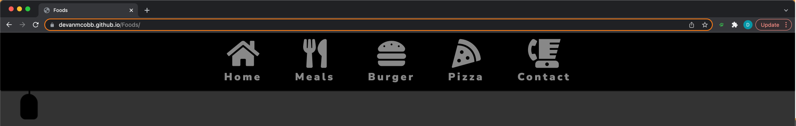
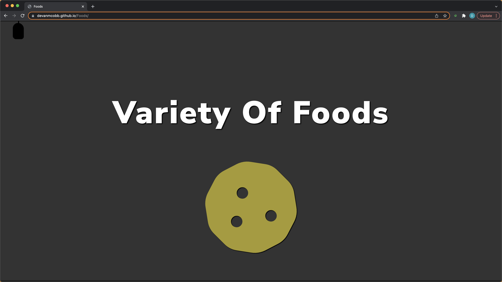
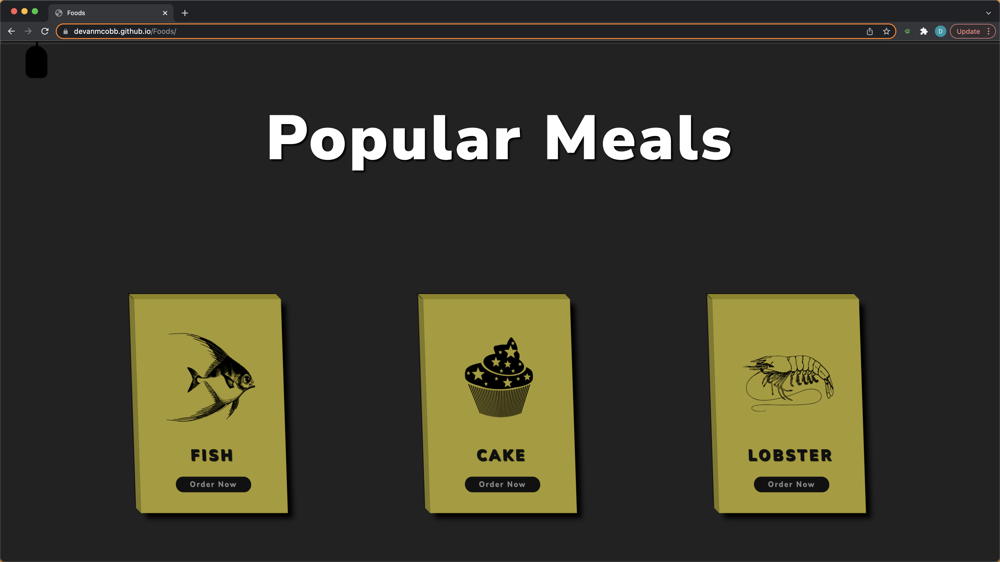
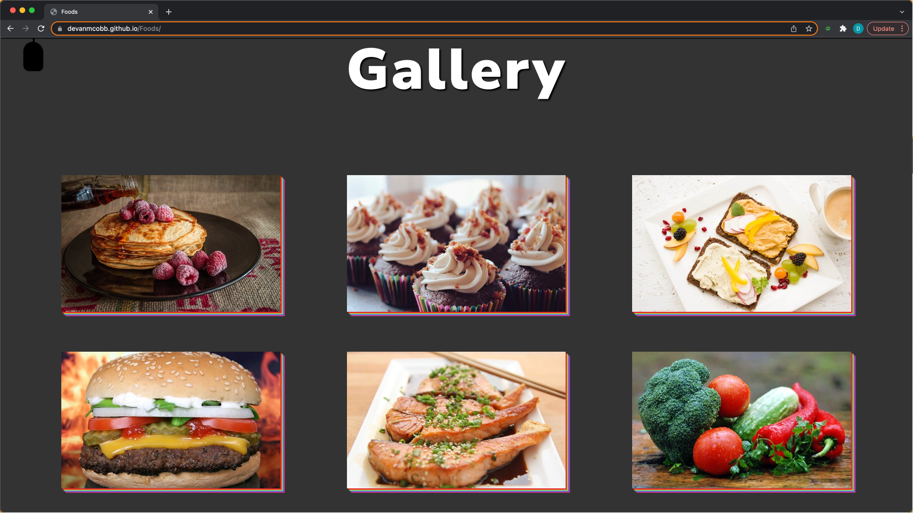
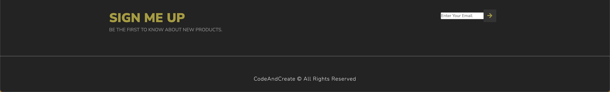

# Foods

A responsive design with custom effects like a hidden navbar feature that smoothly comes to life with a single click. This design would be for a small local meal prepping business/ chef looking to update their presence by taking the initial steps of going responsive. 

## Tech Stack

**Client:** HTML, CSS, JavaScript

## Features

- Dropdown Hidden Navbar
- Slideshow
- 3D cards for weekly featured specials
- Gallery entree images and menu

## Color Reference

| Color             | Hex                                                                |
| ----------------- | ------------------------------------------------------------------ |
| Dark Charcoal |  #333|
| White |  #fff |
| Black |  #000 |
| Lemon Ginger  |  #a79a2d |

## Screenshots

## Questions

For any further questions regarding this project or future collaboration, please contact me at:   [devancobb.dev@gmail.com](devancobb.dev@gmail.com)

## Acknowledgements

 - [Udemy 10 Mega Responsive Websites](https://udemy.com)
 - [#100Devs](https://leonnoel.com/100devs)
 - [freeCodeCamp](https://freecodecamp.com)

